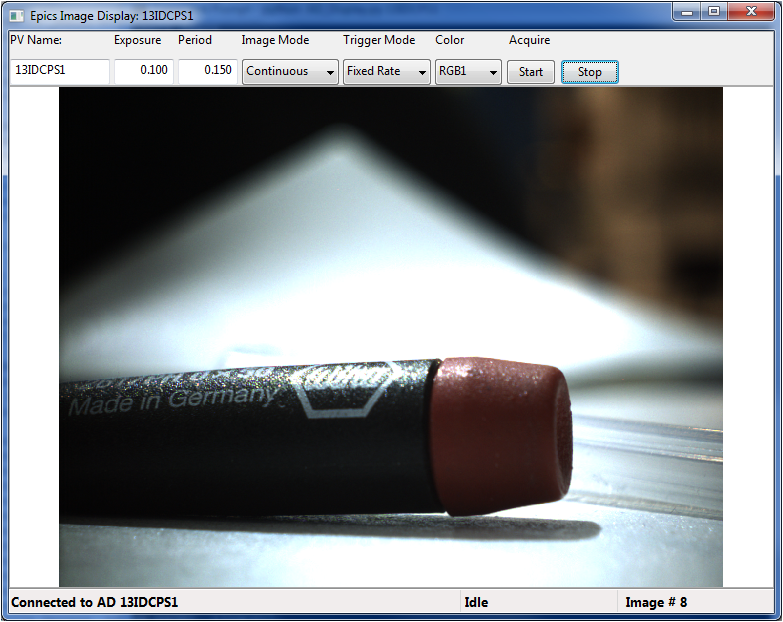

====================================
Area Detector Display
====================================

Epics Area Detector Display is a wxPython GUI application for viewing
images from an Epics Area Detector.  This application requires wxPython,
pyepics, numpy, and the Python Image Libary.

To run this application, simply run AD_Display.py at the command line::
    python AD_Display.py

and enter the base name of the AreaDetector in the PV box.  A sample
display would look like this:

The fields and buttons on the top control several Area Detector settings,
such as starting and stopping the acquisition.  

