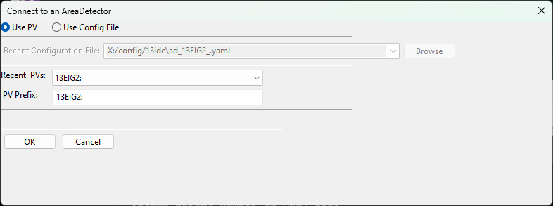

.. _ad_viewer:

Area Detector Display
====================================

AreaDetector Display is a GUI Application for viewing images from an Epics
areaDetector. This provides a simple set of controls for viewing the image from
an areaDetector.  If `epicsapps -m` is run after installation, a folder called
Epics Apps should be placed on your desktop which as a shortcut labeled
areaDetecor_Viewer which can be used to launch the application.  From a command
line terminal, you can also use::

    epicsapps adviewer

This will start with a dialog to either select an areaDetector PV or to
browse for or select an AreaDetector configuration file, which uses yaml syntax.

A few examples of configuration files are given at
https://github.com/pyepics/epicsapps/tree/master/examples/areaDetector, with a sample lookng like this::

    name: IDA Beam Viewer
    prefix: '13IDAPG1:'
    title: AD Display /  IDA Beam Viewer
    camera_attributes: [Acquire, ArrayCounter, ArrayCounter_RBV, NumImages, NumImages_RBV,
      AcquireTime, AcquireTime_RBV, TriggerMode, TriggerMode_RBV]
    colormaps: [gray, magma, inferno, plasma, viridis, coolwarm, hot, jet]
    colormode: Mono
    default_rotation: 0
    enabled_plugins: [image1, Over1, Over2, Over3, Over4, ROI1, ROI2, JPEG1, TIFF1]
    epics_controls:
    - [Trigger Mode, 'cam1:TriggerMode', true, pvenum, _RBV, 150, 10]
    - [Image Mode, 'cam1:ImageMode', true, pvenum, _RBV, 150, 10]
    - ['# Images', 'cam1:NumImages', true, pvfloat, _RBV, 100, 10]
    - [Acquire Time, 'cam1:AcquireTime', true, pvfloat, _RBV, 100, 10]
    - [Acquire Period, 'cam1:AcquirePeriod', true, pvfloat, _RBV, 100, 10]
    - [TIFF File Path, 'TIFF1:FilePath', true, pvtctrl, false, 250, 10]
    - [Acquire Status, 'cam1:Acquire', true, pvtext, false, 250, 10]
    filesaver: 'TIFF1:'
    free_run_time: 0.2
    image_attributes: [ArrayData, UniqueId_RBV]
    show_thumbnail: true
    thumbnail_size: 100
    use_filesaver: true
    workdir: /home/user
    scandb_instrument: Pinhole Tank BPM

This describes how the `adviewer` application will connect to the areaDetector,
including which PVs to include for a very basic widget controls with a limited
set of Process Variables described such as those for starting and stopping the
acquisition.  This configuration file will generate an interface like this:

.. image:: images/AD_Display.png

Note that the `epics_controls` is a list of data for PVs to be displayed in the
upper left portion of the window.  From the configuration file above,
note::

    epics_controls:
    - [Trigger Mode, 'cam1:TriggerMode', true, pvenum, _RBV, 150, 10]
    - [Image Mode, 'cam1:ImageMode', true, pvenum, _RBV, 150, 10]

Each item in the `epics_controls` list has values of

   * display name, here "Trigger Mode"
   * Epics PV to use, here "cam1:TriggerMode"
   * whether to prepend the AD PV Prefix, here "13IDAPG1:" to the PV name, here "true".
   * what kind of PV it is -- enum, float, text, which will determine what type of widget is use, heree "pvenum".
   * what suffix (if any) to use for a "readback PV", here "_RBV", common for many AD PVs
   * the size of the widget in pixels, here 150
   * the font size for the widget, here 10.

The areaDetector display will allow changing color table lookup using
a few supplied colortables (from matplotlib) - reversing that color
table is allowded.

Contrast levels can be set using a percentage value to clip the
intensity range. That is, a value of 1 will set the intensity range to
be from the 1%% to 99%% intensity level of the entire image.  This can
be a very useful option for many areaDetectors either with bad pixels
or high dynamic range, as the full scale image is often unusable.

In addition, the display shows a "thumbnail image" with an ajustable
size.  At startup, this is centered on the image, but clicking the
mouse on the image will center that portion of the image in the Zoom
box.

Finally, if an Epics ScanDB data is setup with `Instruments` and a
postgresql database, saved positions from one or more instruments can
be included in the display, for example to move a camera or shutter
into saved positions.
