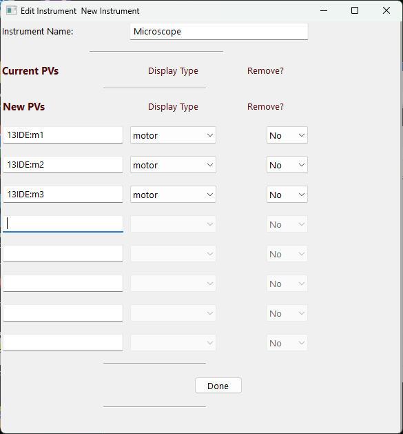
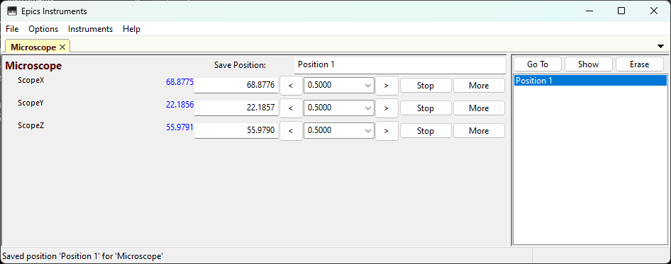
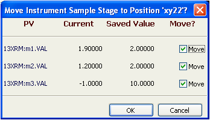
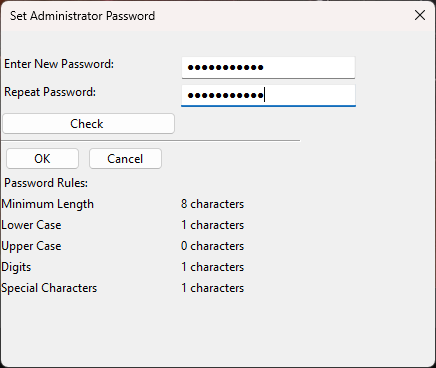
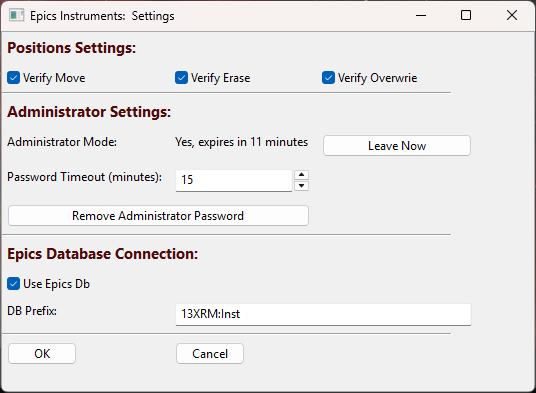
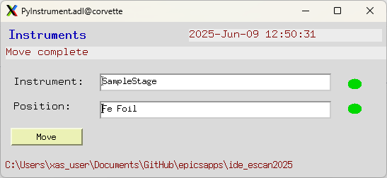

.. _PyInstrument.db: https://raw.githubusercontent.com/pyepics/epicsapps/refs/heads/master/examples/instruments/epics_client/PyInstrument.db
.. _PyInstrument.adl: https://raw.githubusercontent.com/pyepics/epicsapps/refs/heads/master/examples/instruments/epics_client/PyInstrument.adl

.. _instruments:

Epics Instruments
====================================

Epics Instruments is a GUI application (using wxPython) that lets any user:

  * Organize PVs into Instruments: a named collection of PVs
  * Manage multiple Instruments with Notebook or tabbed interface.
  * Save Positions for any Instrument by name.
  * Restore Positions for any Instrument by name.
  * Saves all information into a single databases file that can be loaded later.
  * An administrator password can be set to allow both "expert mode"
    and "user mode".  Each Instrument can be optionally made "admin
    only" or available in "user mode".

The Instruments application was originally written to replace and
organize the multitude of similar MEDM screens that appear at many
workstations using Epics.

Running Epics Instruments
-----------------------------

If `epicsapps -m` is run after installation, a folder called ``Epics
Apps`` will be created on your desktop which has a shortcut labeled
Instruments with a piano keyboard icon that can be used to launch the
Instruments application.  From a command line terminal, you can also
use::

   epicsapps instruments

.. image:: images/Inst_Startup.png
    :width: 80%

If this is your first time using the application, choose a name for
your Instruments database, and hit return to create a new Instrument
File.  The next time you run Epics Instruments, it will remember
which files you have recently used, and present you with a drop-down
list of Instrument Files.  Since all the definitions, positions, and
settings are saved in a single file, restoring this file will recall
the earlier session of instrument definitions and saved positions.

The Instruments database file can contain multiple Instruments.  Each
**Instrument** is a collection of Epics PVs.  Each Instrument will
also have a collection of **Positions**, which are just the locations
of all the PVs in the Instrument at the time the Position was saved.
Like a PV, each Instrument and each Position for an Instrument has a
unique name.

Defining a New Instrument
~~~~~~~~~~~~~~~~~~~~~~~~~~~~~~~~~~~~

To define a new Instrument, select ``Create New Instrument`` from the
``Instruments`` Menu.  A screen will appear in which you can name the
instrument and the PVs that belong to it

when you have added the PVs you want click the ``Done`` button.  The
PVs will connect, and you will see a screen something like this

For PVs that are motor ``.VAL`` positions, you get a row for each
motor to move it around.  For other PVs, you will simply get an Entry
box to see its current value and be able to change it.

At any time, you can save the "current position" by typing a name in
the ``Save Position`` box and hit return.  It will then appear in the
Position List on the right-hand side of the display.   From this list,
you can highlight any saved Position and hit the ``Go To`` button
which will bring up a dialog window like this:

to move all or a selected subset of the PVs to that saved Position.

Editing an Exisiting Instrument
~~~~~~~~~~~~~~~~~~~~~~~~~~~~~~~~~

To change the definition of an instrument, use the ``Current
Instrument: Edit`` option from the ``Instruments`` menu.

.. image:: images/Inst_Edit.png
    :width: 50%

There are also dialogs from the ``Instruments`` menu to allow you to
erase many positions at once or add a position that is not the current
position of the Instrument.

The Instrument File
-----------------------

All the information for definitions of your Instruments and
their Positions are saved in a single file -- the Instruments file.
This is an SQLite database file, though it uses the default extension
of '.ein' (Epics INstruments).

You can copy, save, and use as many of Instrument Files as you like --
you might want to have one for different stations or modes of
operations.  Since the Instrument File is an SQLite database file, and
can be browsed and manipulated with external tools such as the
`sqlite3` command-line program. SQLite files can only be used safely
by one application at a time, and can become corrupted if written to
my multiple processes.  Keep a backup, and avoid having a single
Instrument file open by multiple applications.

If you are interested in using Epics Instruments from multiple
applications, Postgresql can be used in place of SQLite.  (Mysql or
other database servers could probably be supported, but have not been
tried).   See :ref:`pg_instruments` for more information.

Setting and Using and an Adminstrator Password
------------------------------------------------

It may be desirable to limit user access to some Instruments.  That
is, a beamline scientist may want to define Instruments that control
upstream optics or detector configurations that are useful for setting
up an experiment, but not allow users to change these without
supervision. On the hand, there may be Instruments defined that the
user is expected to use.

For this need, an Adminstrator Password can be set for each
Instruments file.  To do this, use the ``Option->Set Administrator
Password`` menu which will bring up a dialog to set or reset a
password.

The password must be fairly strong (8 or more characters,
at least 1 upper case letter, 1 lower case letter, 1 digit, and 1
special character). The password will be encrypted using standard
hashing methods and the encrypted string saved in the Instruments
file.  While this possword may be protecting equipment but not
sensitive information, the encrypted string is saved in a readable
file.  It is recommended to not re-use a password that is used for
more important information.

When a adminstrator password is set, the user of the application will
be challenged for this password to do any of the following tasks:

  * edit the configuration settings.
  * change what Instruments are displayed.
  * create an Instrument.
  * edit or access any Instrument that is marked as `admin only`.
  * change the password.

When a user goes into "Admin Mode", there is a time-out for staying in
that mode.  By default, this is 15 minutes, but it can be changed in
the configuration window.  When this time elapses, any Instrument that
is currently shown but is marked as `admin only` will be removed from
the display.

This timeout can be set from ``Options->General Settings``:

From this screen you can also leave Administrator Mode immediately or
completely remove the Adminstrtator password so that no Adminsitrator
Mode will be enabled.

Accessing Instruments and Positions with Epics
------------------------------------------------

You may want to be able to access Instrument and Positions from outside the
Instruments application.  For example, you may want to define an Instrument for
"Detector Stages", and save positions called "In" and "Out".  It would be
helpful if you could move the detector to "In" or "Out" from Epics Channel
Access, either from a script or a data collection application.

Instruments can be set up to respond to Channel Access puts and move an
Instrument to a Position.  To do this, use `PyInstrument.db`_, and load that
into an Epics IOC with a command like::

    dbLoadRecords("PyInstrument.db","P=13XRM:, Q=Inst")

From the ``Options->General Settings`` menu (see above), you can
check the "Use Epics Db" box and entering the Prefix defined with the
`dbLoadRecords` command will then enable the Instruments program to
respond to Channel Access requests to move Instruments to Positions.

Using the `PyInstrument.adl`_ display file and an MEDM command like::

    medm -x -macro "P=13XRM:,Q=Inst" /home/epics/adl/all/PyInstruments.adl

will then bring up a display screen like this

where you can enter the name of an Instrument, enter the name of a Position,
and hit the Move button to move to that position. Several Epics PVs listed in
the table below are used for this communication.  Note that the Instruments App
itself must be running in order for these moves to happen.

.. _instruments_pv_table:

**Table of CA interface to Instruments** These PVs will be used for the CA
interface to Epics Instruments.

  +-----------------------+-------------------------------------------------+
  | PV Name               |       Description                               |
  +=======================+=================================================+
  | $(P)$(Q):InstName     | Instrument Name                                 |
  +-----------------------+-------------------------------------------------+
  | $(P)$(Q):PosName      | Position Name                                   |
  +-----------------------+-------------------------------------------------+
  | $(P)$(Q):InstOK       | Flag for Instrument Name is valid               |
  +-----------------------+-------------------------------------------------+
  | $(P)$(Q):PosOK        | Flag for Position Name is valid                 |
  +-----------------------+-------------------------------------------------+
  | $(P)$(Q):Move         | Command to Move                                 |
  +-----------------------+-------------------------------------------------+
  | $(P)$(Q):Message      | Runtime message                                 |
  +-----------------------+-------------------------------------------------+
  | $(P)$(Q):TSTAMP       | timestamp, showing Instrument is connected.     |
  +-----------------------+-------------------------------------------------+

From pyepics, you could also do a move with::

    from epics import get_pv, poll
    prefix = '13XRM:Inst:'
    move_pv = get_pv(f'{prefix}Move')
    iname_pv = get_pv(f'{prefix}InstName')
    pname_pv = get_pv(f'{prefix}PosName')
    iok_pv = get_pv(f'{prefix}InstOK)
    pok_pv = get_pv(f'{prefix}PosOK')

    def move_instrument(instrument, position):
        iname_pv.put(instname)
        pname_pv.put(posname)
        poll()
        if iok_pv.get() == 0:
            print(f"Could not find instrument '{instname}'")
        elif pok_pv.get() == 0:
            print(f"Could not find position '{posname}' for '{instname}'")
        else:
            move_pv.put(1)

    move_instrument('SampleStage', 'Sample 1')

.. _pg_instruments:

Using PostgresQL and the EpicsScan Datatbase
------------------------------------------------------------

If you want to have
are using the EpicsScan application for data collection, you can also
use its Postgres database as an Epics Instruments database.  This requires a
bit more setup, but allows mulitple client programs to access and use the
Instruments at the same time.
