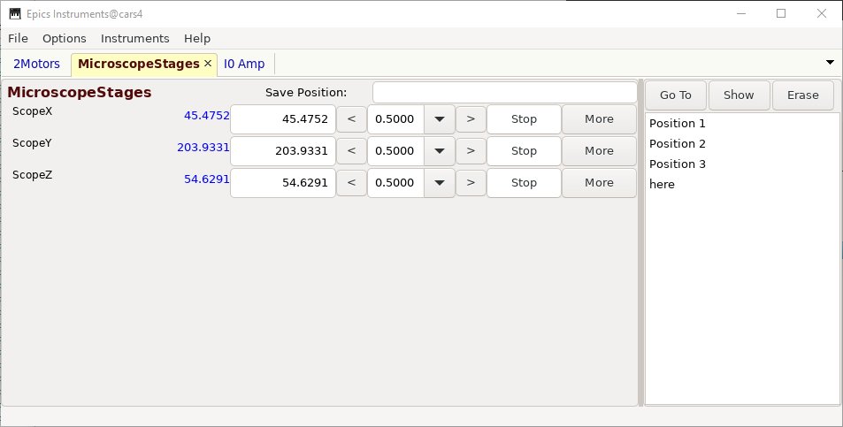

====================================
Using Epics Instruments
====================================

Epics Instruments is a GUI application (using wxPython) that lets any user:

  * Organize PVs into Instruments: a named collection of PVs
  * Manage Instruments with modern Notebook-tab interface.
  * Save Positions for any Instrument by name.
  * Restore Positions for any Instrument by name.
  * Remember Settings for all definitions into a single file that can be loaded later.
  * Multiple Users can be using multiple instrument files at any one time.

It was originally written to replace and organize the multitude of similar MEDM
screens that appear at many workstations using Epics.

Running Epics Instruments
~~~~~~~~~~~~~~~~~~~~~~~~~~

To run Epics Instruments, use::

   epicsapps instruments

or click on the icon.

A small window to select an Epics Instrument File, like this

.. image:: images/Inst_Startup.png

If this is your first time using the application, choose a name, and hit return
to start a new Instrument File.  The next time you run Epics Instruments, it
should remember which files you have recently used, and present you with a
drop-down list of Instrument Files.  Since all the definitions, positions, and
settings are saved in a single file, restoring this file will recall the
earlier session of instrument definitions and saved positions.

An Epics **Instrument** is a collection of PVs.  Each Instrument will also
have a collection of **Positions**, which are just the locations of all the
PVs in the instrument at the time the Position was saved.  Like a PV, each
Instrument and each Position for an Instrument has a unique name.

Defining a New Instrument
~~~~~~~~~~~~~~~~~~~~~~~~~~~~~~~~~~~~

To define a new Instrument, select **Create New Instrument** from the
Instruments Menu.  A screen will appear in which you can name the
instrument and the PVs that belong to the Instrument.

If you add a few PVs and click OK, the PVs will connect, and you will see a
screen something like this

Editing an Exisiting Instrument
~~~~~~~~~~~~~~~~~~~~~~~~~~~~~~~~~

.. image:: images/Inst_Edit.png

The Instrument File
~~~~~~~~~~~~~~~~~~~~~~~

All the information for definitions of your Instruments and their Positions
are saved in a single file -- the Instruments file, with a default
extension of '.ein' (Epics INstruments).   You can use many different
Instrument Files for different domains of use.

The Instrument File is an SQLite database file, and can be browsed and
manipulated with external tools.  Of course, this can be a very efficient
way of corrupting the data, so do this with caution.  A further note of
caution is to avoid having a single Instrument file open by multiple
applications -- this can also cause corruption.  The Instrument files can
be moved around and copied without problems.
