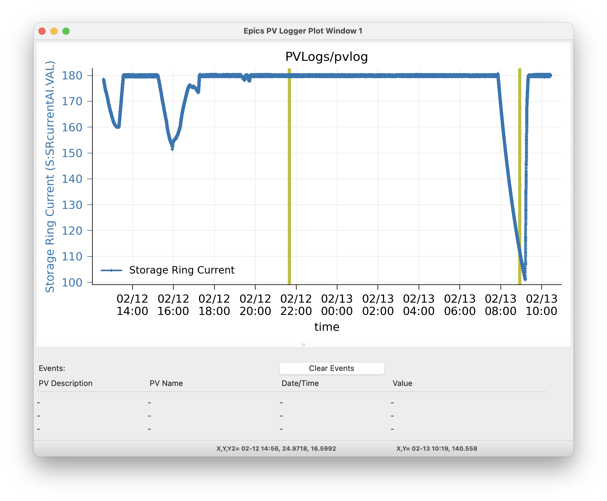

.. _wxmplot: https://newville.github.io/wxmplot/

.. _pvlogger:

PV Logger
====================================

The Epics PV Logger collects timeseries of a set of PVs into plain
text data files in a folder, and displays these data back for
exploratory analysis.  This is intended for a modest number of PVs
that are not the primary data being collected during an experiment,
for a limited time.  The typical use-case could be expressed as
"around 100 PVs for a week", which is typical for a single experiment
at a synchrotron beamline.

For such experiments, it is often useful to collect values like
Storage Ring Current, room temperature, positions and temperature of
beamline optics and components, and detector settings from existing
Epics PVs.  This sort of *metadata* cold be put into every data
fil. While some metadata surely belongs in each data file, items like
temperature of an upstream mirror or values of beam position monitors
are really not metadata about the individual data file.  And, while
there are several larger systems for archiving and retrieving PV
variables for the whole facility or beamline, these are often meant to
be facility-wide systems, and not about individual experiments.  Such
systems may not be easily available after the experiment or away
from the beamline.

We found that metadata stored in data file headers or large databases
oten makes it hard to investigate how values changed over the course
of an experiment.  Sometimes, it would be nice to browse and compare a
few Time Series plots for a handful of PVs and to compare those with
timestamps of the primary data files.

The PVLogger application aims to fill this gap and is designed to
collect the meta-data for a particular experiment in a way that can be
easily digested and investigated during and after the experiment has
ended. Another way of looking at it is that it expands the
:ref:`stripchart` application to collect and view many PVs and
preserve and organize the data for future use.

The PVLogger application has two mode of operation: *collecting data*
and *viewing data*.  A command-line program run at the beamline will
collect the data into a dedicated folder using a simple configuration
file to control what data is collected.

The PVLogger GUI Application can read the data collected into such a
folder and allow visualization of the logged data.  While at the
beamline, The PVLogger application can also be used to launch a
:ref:`stripchart` application to plot a live view of the changing
data.  Finally, the PVLogger application can be used to read, modify,
and save existing configuration files, listing which PVs to log, and
can start the data collection process.

If date and times seem to shown with the wrong timezone, see :ref:`stripchart_timezone`.

Viewing PVLogger Data
--------------------------

For data that has already been collected, the PVLogger GUI Application
can read the data collected into the PVLOG folder, and display
it. With Desktop Shortcuts installed (see :ref:`install_icons`), this
application can be launched from the `PVLogger` shortcut with the icon
of logs in the `Epics Apps` folder, or from the command line with::

       epicsapps pvlogview

Opening an existing folder will give a main window display like:

.. image:: images/pvlogger_mainview.png

The Left-hand column will show the list of of PVs that were logged
into the folder.  The names shown will generally be the "description"
saved for the PV, sometimes with the PV name if the description is not
unique. Each has a Check Box that you can use to select many PVs at
once.  The "Clear Selections" button in the upper left will clear all
checked PVs.  The right-hand portion has 2 Notebook Tabs, labelled
"View Log Folder" and "Collect Data" -- we'll discuss the "View Log
Folder" tab here and the "Collect Data" tab in the next section.

The "View Log Folder" Panel allows you to select what edata to
visualize. The folder being read is If Epics Instruments were used in
the data collection, you can select these and then press "Select these
PVs" to check each of the PVs in that Instrument.

The central portion of the panel shows up to 4 PVs to be
displayed. Each of these has a Dropdown list will all the PV
descriptions.   Selecting any PV in the left-hand PV list will select that
for  "PV 1".  Clicking the "Use Selected PVs" button will select
the first 4 checked PVs from the PV List.  Clicking "Clear PVs 2,3,4"
will clear those PVs (that is, select "None).

Below the list of PVs are buttons for what to display.  The "Show PV
1" button will display the data for the PV selected as "PV 1" The
"Show Selected" will display the data for all (up to 4) selected PVs.
For most PVs, the data will be numerical, and the "Show" buttons will
display a graph of the time dependence of the PV(s).  Up to 10 Plot
windows can be used, and you can select which to use for any display
by selecting "Window 1" through "Window 10".

Below the buttons to plot the logged values, are buttons for "Live
Plots".  When used at the beamline or from a computer that can connect
to the live beamline PVs, clicking on the "Live Plot for PV 1" will
show the corresponding PV in a live :ref:`stripchart` application.

Finally, below the "Live Plot" section, there are Date and Time
entries to view Event Data.  We'll return to this in the next section
:ref:`pvlogger_event_data`.

As an example plot of one PV, with "Storage Ring Current (mA)" as PV
1, clicking the "Show PV 1" button will show:

.. image:: images/pvlogger_plotone.png

selecting 2 PVs to plot together will show a plot like:

.. image:: images/pvlogger_plotsel.png

For PV data that is in the form of discrete states or enumerated data
(often from "multi-bit binary data" Epics records), the plot will show
the enumerated strings on the plot labels, as:

.. image:: images/pvlogger_plotenum.png

For all plots, there is good interactivity including

 1. use Mouse-Down and Drag to Zoom in over a selected region.
 2. Ctrl-Z will Zoom out.
 3. clicking on the plot label in the Legend will toggle
    whether that trace is displayed.
 4. Ctrl-L will toggle the Legend on and off.
 5. Ctrl-C will copy the image to the system clipboard.
 6. Ctrl-S will save the image to a PNG file.
 7. Ctrl-K will show a more complete configuration window
    where you can adjust titles and colors.

For more details, see `wxmplot`_.

.. _pvlogger_event_data:

Event Data: viewing non-numerica data
~~~~~~~~~~~~~~~~~~~~~~~~~~~~~~~~~~~~~~~~~~~~~~~~

Some data is not numerical but text, and so not easily plotted. To be
clear, PVs with enumerated or multi-bit binary values can be plotted,
as shown above.  For PV values that is changing strings (or long
character waveforms) as for file names or recorded commands, PVLogger
will show a table of values with timestamps:

Reading the history of values can be useful. Selecting a few of these
recorded "Events" and pressing the "Show Selected" Button will put
vertical lines (of the selected color) on the plot window at the times
of those values, looking like:

Since vertical lines may be shown for many such "Events" and do not
otherwise show the data values, clicking on the vertical bar for the
time of each event will print the PV description, name, time of event,
and value in the table just below the plot. The most recently selected
event will be shown at the top, with the previous selected events
below that.  Clicking the "Clear Events" button on the plot window
will clear the table.

For PVs that are Epics Motors several fields besides the main Drive Value (see
:ref:`pvlogger_motor_data`) will be logged.  These other values are
not expected to change very often, and so will be displayed are Events
for the Motor Drive PV.

In addition to showing showing Events for each PV in a single table
so that selected events can be placed on a plot, you can also use the
date and time entries at the bottom of the main viewing panel to create a
single table showing all events for a set of PVs for a selected time
range.

Collecting PVLogger Data
----------------------------

For data collection, PVLogger will read a YAML-formatted configuration
file to tell it what PVs to collect, and where to save the data.  A
typical file might look like this::

    datadir: '/server/data/beamlineX/2025/userABC'
    end_datetime: '2025-03-12 09:00:00'
    pvs:
    - S:SRcurrentAI.VAL        | Storage Ring Current | 0.005
    - 'RF-ACIS:FePermit:Sect1To35IdM.VAL | Shutter Permit | 0 '
    - SXID:DSID:GapM.VAL      | ID Gap  (mm)      | 0.001
    - SXID:DSID:TaperGapM.VAL | ID Gap Taper (mm) | 0.001
    - XX:m1.VAL               | <auto>            | 0.001
    - XX:m2.VAL               | <auto>            | 0.001
    - XX:m3.VAL               | <auto>            | 0.001
    - XX:m4.VAL               | <auto>            | 0.001
    - XX:DMM1Ch1_calc.VAL     | Mono Temperature 1   | 0.01
    - XX:DMM1Ch2_calc.VAL     | Mono Temperature 2   | 0.01
    - XX:DMM1Ch3_calc.VAL     | Mono Temperature 3   | 0.01
    - XX:E_BPMFoilPosition.VAL
    instruments:
    - SampleStage

Here, `datadir` gives the path to the main working directory, say for
the whole experiment.  A folder named `pvlog` will be created in this
data directory to hold all the data collected by PVLogger.  In this
case, a folder named '/server/data/beamlineX/2025/userABC/pvlog` will
be created and used for data collection.

The `end_datetime` value gives the date and time for data collection
to stop.

The `pvs` section gives a list of PVs to monitor and collect
data. Each line is formed as::

      PVName   |   Description  | Monitor_Delta

The PV name is required.  Note that, as for one of the examples
above where `-` is in the PV name that the entire line is in quotes.

The Description field is option. If missing or the word '<auto>' is
used, the PVLogger will try to get this from the corresponding `.DESC`
field for the PV.  The description set or determined here will be used
when displaying the data later (as shown above), so some care in
choosing a good description is encouraged.

The optional `Monitor Delta` value gives the minimal change in the PV
value that will be recorded. It applies only to Analog, floating point
value.  This value is absolute, not relative, and it is referenced to
the last reported value so that slow cumulative changes are seen, just
with fewer intermediate values. For more details, see
:ref:`pvlogger_monitor_delta`.

Running PVLogger to collect data
~~~~~~~~~~~~~~~~~~~~~~~~~~~~~~~~~~

With an existing PVLog configuration file, say `my_pvlog.yaml`,
Logging can be started with::

   epicsapps pvlogger my_pvlog.yaml

This will start collection in the folders specified in the
configuration file.

.. _pvlogger_monitor_delta:

`Monitor Delta` for PVLogger
~~~~~~~~~~~~~~~~~~~~~~~~~~~~~~~~~~~~~~~~

The `Monitor Delta` value for each PV listed in the configuration file
gives the minimal change in analog (floating point) PV value that will
be recorded.  This value is absolute, not relative, and it is
referenced to the last reported value so that slow cumulative changes
are seen, just with fewer intermediate values.

If explictly set (not `<auto>`), PVLogger will try to set the `.MDEL`
field of the record. This will limit the number of events sent for
this PV from the CA server to only those that exceed the last reported
value by this amount.  If the `.MDEL` field cannot be set (perhaps due
to permission issues), all events will be sent from the CA server, and
PVLogger will emulate this, recording only those values that change by
this amount.

Note that many PVs will have `.MDEL` set to 0 by default so that all
events are captured.  Note also that it values for `.MDEL` are often
not preserved by "save-restore" processes and so may be lost if the
host IOC is restarted.

.. _pvlogger_motor_data:

Data for Epics Motors
~~~~~~~~~~~~~~~~~~~~~~~~~~~~~~~~~~~

PV Logger generally assumes that only the requested field for a PV is
collected. For Epics Motors that are requested to be logged, the VAL
(drive) field will generally be requested.   In addition, all Epics
Motors also have the following fields monitored and logged::

   .OFF, .FOFF, .SET, .HLS, .LLS, .DIR, _able.VAL, .SPMG

Changes to these fields will generally be very rare, but may change
the meaning of the VAL field.  These fields are recorded separately,
each to its own data file.  When read in by the PVLog Viewer, these
values will be presented as Events that can be displayed with the
Motor values.

Using Epics Instruments
~~~~~~~~~~~~~~~~~~~~~~~~~~~~~~~~~~~

If using :ref:`instruments` with a PostgresQL database, and if the
environmental variable `ESCAN_CREDENTIALS` is set, then any of the
existing Instruments in the database can be loggged simply by giving
its name in the `instrumenst` setting of the configuration file.
Setting this will log all of the PVs defined for that Instrument.

.. _pvlogger_adding_pvs:

Adding PVs to a running PVLogger
~~~~~~~~~~~~~~~~~~~~~~~~~~~~~~~~~~~

You may want to add more PVs to a running PVLogger instance.  To do
this, you can write a YAML file in the same format as the main
configuration file with the additional PVs.   When you have this file
created, perhaps something like::

    pvs:
    - XXX:m20.VAL  | station slit horiz pos | 0.001
    - XXX:m21.VAL  | station slit horiz wid | 0.001
    - XXX:m22.VAL  | station slit vert pos | 0.001
    - XXX:m23.VAL  | station slit vert wid | 0.001

you can copy that to a file named `_PVLOG_requests.yaml` in the running
`pvlog` folder.

You can also set the `end_datetime` in the `_PVLOG_request.txt` file
to change the ending data collection time.

Stopping Data Collection
~~~~~~~~~~~~~~~~~~~~~~~~~~~~

Data collection can be stopped a few different ways:

1. Setting the `end_datetime` value in the configuration file,
   including in the `_PVLOG_requests.txt` file described in
   :ref:`pvlogger_adding_pvs`.
2. Writing a file named `_PVLOG_stop.txt` (this can be empty) to the
   running `pvlog` folder.  This will stop collection within 30 seconds.
3. Kiling the running process.

Options 1 and 2 are recommended, as they will write data that has been
collected but not yet written, will finalize the timestamps, and will
cleanly disconnect from the Epics IOCs.

The PVLog Folder
~~~~~~~~~~~~~~~~~~~~~~~~~~~~

An important feature of PVLogger is that all of the files are readable
plaintext files that will be readable in the future.

As mentioned above, there are a few files with names like `_PVLOG_xx.yyy`
in the `pvlog` folder that contain some information about the
PVLogger process and data. These files are listed in the table below.

.. _pvlogger_file_table:

**Table of PVLogger Files** These files describe the data in
the`pvlog` folder.  Files with the extension `.yaml` are expected to
be valid YAML-formatted files, while other files are generic plain
text.

  +----------------------+-------------------------------------------------------------------------+
  | filename             |  description                                                            |
  +======================+=========================================================================+
  | _PVLOG.yaml          | expanded configuration file of what is collected in the folder          |
  +----------------------+-------------------------------------------------------------------------+
  | _PVLOG_filelist.txt  | list of PV names and their individual log file names                    |
  +----------------------+-------------------------------------------------------------------------+
  | _PVLOG_runlog.txt    | runtime messages                                                        |
  +----------------------+-------------------------------------------------------------------------+
  | _PVLOG_timestamp.txt | a timestamp, machine id, and process id for PVLogger process            |
  +----------------------+-------------------------------------------------------------------------+
  | _PVLOG_stop.txt      | special empty file to stop running PVLogger                             |
  +----------------------+-------------------------------------------------------------------------+
  | _PVLOG_requests.yaml | special file to add more PVs to a running PVLogger                      |
  +----------------------+-------------------------------------------------------------------------+

 For most data, the PV values will be numerical, and the log files themselves will look like this::

   # pvlog data file
   # pvname        = S:SRcurrentAI.VAL
   # label         = Storage Ring Current
   # monitor_delta = 0.01
   # start_time    = 2025-02-12 12:34:40
   # count         = 1
   # nelm          = 1
   # type          = time_double
   # units         = mA
   # precision     = 1
   # host          = geopv-gw.cars.aps.anl.gov:5064
   # access        = read-only
   #---------------------------------
   # timestamp       value             char_value
   1739385275.396   178.46212306082   178.5
   1739385276.396   178.43699046168   178.4
   1739385277.397   178.41167158919   178.4
   1739385278.397   178.62177039127   178.6

with a header showing information anbout the PV and logging, and then
columns of timestamp (seconds since 1970 as a double precision float,
to millisecond precision), value, and the string representation of the
value (here, formatted with the PVs precision).

For PVs holding enumerated values, the header section will include a
list of enumeration states, perhaps::

   # pvlog data file
   # pvname        = 13IDA:E_BPMFoilPosition.VAL
   # label         = BPM Foil
   # monitor_delta = None
   # start_time    = 2025-02-12 12:34:40
   # count         = 1
   # nelm          = 1
   # type          = time_enum
   # units         = None
   # precision     = None
   # host          = corvette.cars.aps.anl.gov:38983
   # access        = read/write
   # enum strings:
   #      0 = Open
   #      1 = Ti
   #      2 = Cr
   #      3 = Ni
   #      4 = Al
   #      5 = Au
   #---------------------------------
   # timestamp       value             char_value
   1739374463.293  2                  Cr
   1739385331.821  3                  Ni

The intention is that these files will be read by the PVLogger codes itself.

Using the PVLog Data from Python
~~~~~~~~~~~~~~~~~~~~~~~~~~~~~~~~~~~~~

To read the PVLogger data from a Python application, you can first
read the data for the `pvlog` folder, and then data for individual
log files::

  >>> from epicsapps.pvlogger import read_logfolder
  >>> folder = read_logfolder('pvlog')

This reads the data about the folder, but does not read the individual
logfiles.  To find the available PVs from the folder, use:::

  >>> folder.pvs.keys()

and to read an individual log file for a PV, use

  >>> folder.read_logfile(PVNAME)

which will put the data into the `data` attribute of
`folder.pvs[PVNAME]`, so that you can extract the list of
timestamps and values, from the `data` attribute of the `folder.pvs`::

  >>> timestamps = folder.pvs[PVNAME].data.timestamps
  >>> values     = folder.pvs[PVNAME].data.values

and so forth.  To plot the data, as with the PV Logger GUI, you could
sdo something like::

  >>> from wxmplot.interactive import plot
  >>> dates = folder.pvs['S13ID:USID:TaperGapM.VAL'].data.get_mpldates()
  >>> plot(dates, values, use_dates=True)
