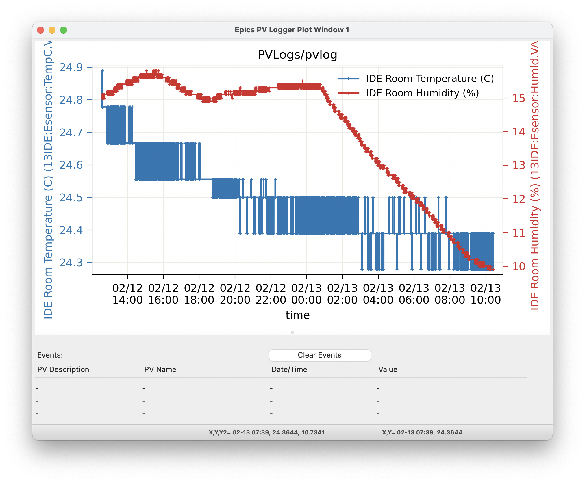

.. _wxmplot: https://newville.github.io/wxmplot/

.. _pvlogger:

PV Logger
====================================

The Epics PV Logger collects timeseries of a set of PVs into plain
text data files in a folder, and displays these data back for
exploratory analysis.  This is intended for a modest number of PVs
that are not the primary data being collected during an experiment,
for a limited time.  The typical use-case could be expressed as
"around 100 PVs for a week", which is typical for a single experiment
at a synchrotron beamline.

For such experiments, it is often useful to collect values like
Storage Ring Current, room temperature, positions and temperature of
beamline optics and components, and detector settings from existing
Epics PVs.  This sort of *metadata* cold be put into every data
fil. While some metadata surely belongs in each data file, items like
temperature of an upstream mirror or values of beam position monitors
are really not metadata about the individual data file.  And, while
there are several larger systems for archiving and retrieving PV
variables for the whole facility or beamline, these are often meant to
be facility-wide systems, and not about individual experiments.  Such
systems may not be easily available after the experiment or away
from the beamline.

We found that metadata stored in data file headers or large databases
oten makes it hard to investigate how values changed over the course
of an experiment.  Sometimes, it would be nice to browse and compare a
few Time Series plots for a handful of PVs and to compare those with
timestamps of the primary data files.

The PVLogger application aims to fill this gap and is designed to
collect the meta-data for a particular experiment in a way that can be
easily digested and investigated during and after the experiment has
ended. Another way of looking at it is that it expands the
:ref:`stripchart` application to collect and view many PVs and
preserve and organize the data for future use.

The PVLogger application has two mode of operation: *collecting data*
and *viewing data*.  A command-line program run at the beamline will
collect the data into a dedicated folder using a simple configuration
file to control what data is collected.

The PVLogger GUI Application can read the data collected into such a
folder and allow visualization of the logged data.  While at the
beamline, The PVLogger application can also be used to launch a
:ref:`stripchart` application to plot a live view of the changing
data.  Finally, the PVLogger application can be used to read, modify,
and save existing configuration files, listing which PVs to log, and
can start the data collection process.

Viewing PVLogger Data
--------------------------

For data that has already been collected, the PVLogger GUI Application
can read the data collected into the PVLOG folder, and display
it. Opening an existing folder will give a main window display like:

.. image:: images/pvlogger_mainview.png

The Left-hand column will show the list of of PVs that were logged
into the folder.  The names shown will generally be the "description"
saved for the PV, sometimes with the PV name if the description is not
unique. Each has a Check Box that you can use to select many PVs at
once.  The "Clear Selections" button in the upper left will clear all
checked PVs.  The right-hand portion has 2 Notebook Tabs, labelled
"View Log Folder" and "Collect Data" -- we'll discuss the "View Log
Folder" tab here and the "Collect Data" tab in the next section.

The "View Log Folder" Panel allows you to select what edata to
visualize. The folder being read is If Epics Instruments were used in
the data collection, you can select these and then press "Select these
PVs" to check each of the PVs in that Instrument.

The central portion of the panel shows up to 4 PVs to be
displayed. Each of these has a Dropdown list will all the PV
descriptions.   Selecting any PV in the left-hand PV list will select that
for  "PV 1".  Clicking the "Use Selected PVs" button will select
the first 4 checked PVs from the PV List.  Clicking "Clear PVs 2,3,4"
will clear those PVs (that is, select "None).

Below the list of PVs are buttons for what to display.  The "Show PV
1" button will display the data for the PV selected as "PV 1" The
"Show Selected" will display the data for all (up to 4) selected PVs.
For most PVs, the data will be numerical, and the "Show" buttons will
display a graph of the time dependence of the PV(s).  Up to 10 Plot
windows can be used, and you can select which to use for any display
by selecting "Window 1" through "Window 10".

When used at the beamline or from a computer that can connect to the
live beamline PVs, clicking on the "Live Plot for PV 1" will show the
corresponding PV in a live :ref:`stripchart` application.

As an example plot of one PV, with "Storage Ring Current (mA)" as PV
1, clicking the "Show PV 1" button will show:

.. image:: images/pvlogger_plotone.png

selecting 3 PVs to plot together will show a plot like:

For PV data that is in the form of discrete states or enumerated data
(often from "multi-bit binary data" Epics records), the plot will show
the enumerated strings on the plot labels, as:

For all plots, there is good interactivity including

 1. use Mouse-Down and Drag to Zoom in over a selected region.
 2. Ctrl-Z will Zoom out.
 3. clicking on the plot label in the Legend will toggle
    whether that trace is displayed.
 4. Ctrl-L will toggle the Legend on and off.
 5. Ctrl-C will copy the image to the system clipboard.
 6. Ctrl-S will save the image to a PNG file.
 7. Ctrl-K will show a more complete configuration window
    where you can adjust titles and colors.

For more details, see `wxmplot`_.

Seeing "Event Data" -- non-numerica data
~~~~~~~~~~~~~~~~~~~~~~~~~~~~~~~~~~~~~~~~~~~~~

Some data is not numerical but text, and so not easily plotted. To be
clear, PVs with enumerated or multi-bit binary values can be plotted,
as shown above.  For PV values that is changing strings (or long
character waveforms) as for file names or recorded commands, PVLogger
will show a table of values with timestamps:

.. image:: images/pvlogger_table.png

Reading the history of values can be useful. Selecting a few of these
recorded "Events" and pressing the "Show Selected" Button will put
vertical lines (of the selected color) on the plot window at the times
of those values, looking like:

.. image:: images/pvlogger_eventval.png

Since vertical lines may be shown for many such "Events" and do not
otherwise show the data values, clicking on the vertical bar for the
time of each event will print the PV description, name, time of event,
and value in the table just below the plot. The most recently selected
event will be shown at the top, with the previous selected events
below that.  Clicking the "Clear Events" button on the plot window
will clear the table.

Collecting PVLogger Data
----------------------------

PVLogger will read a YAML-formatted configuration file to tell it what
PVs to collect, and where to save the data.  A typical file might look
like this::

    folder: pvlog
    datadir: '/server/data/beamlineX/2025/userABC'
    pvs:
    - S:SRcurrentAI.VAL        | Storage Ring Current | 0.005
    - 'RF-ACIS:FePermit:Sect1To35IdM.VAL | Shutter Permit | 0 '
    - SXID:DSID:GapM.VAL      | ID Gap  (mm)      | 0.001
    - SXID:DSID:TaperGapM.VAL | ID Gap Taper (mm) | 0.001
    - XX:m1.VAL               | <auto>            | 0.001
    - XX:m2.VAL               | <auto>            | 0.001
    - XX:m3.VAL               | <auto>            | 0.001
    - XX:m4.VAL               | <auto>            | 0.001
    - XX:DMM1Ch1_calc.VAL     | Mono Temperature 1   | 0.01
    - XX:DMM1Ch2_calc.VAL     | Mono Temperature 2   | 0.01
    - XX:DMM1Ch3_calc.VAL     | Mono Temperature 3   | 0.01
    - XX:E_BPMFoilPosition.VAL
    instruments:
    - SampleStage

Here, `workdir` gives the path to the working directory, and `folder`
give the name of the PVLogger folder in that working directory to put
the data collected.  In this case, a folder named
'/server/data/beamlineX/2025/userABC/pvlog` will be created and used
for data collection.

The `pvs` section gives a list of PVs to monitor and collect
data. Each line is formed as::

      PVName   |   Description  | Monitor_Delta

The PV name is required.  Note that, as for one of the examples
above where `-` is in the PV name that the entire line is in quotes.

The Description field is option. If left off, or the word '<auto>' is
used, the PVLogger will try to get this from the corresponding `.DESC`
field for the PV.

The `Monitor Delta` value gives the minimal change in the PV value
that will be recorded - it applies only to Analog, floating point
values.  This value is absolute, not relative, and it is referenced to
the last reported value so that slow cumulative changes are seen, just
with fewer intermediate values.

PVLogger will try to set the `.MDEL` field of the record. This will
limit the number of events sent for this PV from the CA server to only
those that exceed the last reported value by this amount.  If the
`.MDEL` field cannot be set (perhaps due to permission issues), all
events will be sent from the CA server, and PVLogger will emulate
this, recording only those values that change by this amount.

Note that many PVs will have `.MDEL` set to 0 by default so that all
events are captured.

Running PVLogger to collect data
~~~~~~~~~~~~~~~~~~~~~~~~~~~~~~~~~~

With an existing PVLog configuration file, say `my_pvlog.yaml`,
Logging can be started with::

   epicsapps -c pvlogger my_pvlog.yaml

The PVLog Folder
~~~~~~~~~~~~~~~~~~~~~~~~~~~~
