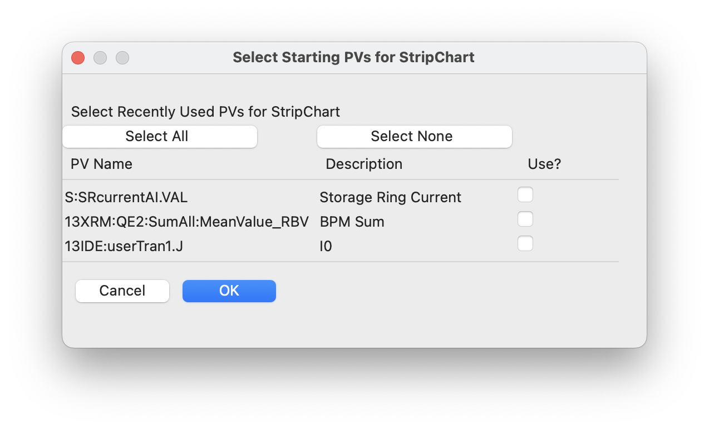

.. _stripchart:

Strip Chart Display
====================================

StripChart is a GUI application for viewing live time series of PVs.
The plots are dynamically updated as the PVs change value. Up to 4 PVs
can be plotted at a time, with convenient controls for changing the
time range displayed, and setting labels, value ranges, and colors for
each PV. Plotting can be paused and resumed, though data collection
will continue in the background even while plotting is paused.
Interactive graphics with click-and-drag zooming are used, and figures
of plots can be saved as high-quality PNGs, or data can be exported to
plain text files.

Running  Stripchart
~~~~~~~~~~~~~~~~~~~~~~

If `epicsapps -m` is run after installation, a folder called Epics Apps
should be placed on your desktop which has a shortcut labeled StripChart which
can be used to launch the Stripchart application.  From a command line
terminal, you can also use::

    epicsapps stripchart

On startip, you will be prompted for a Working Directory. If a
configuration file `stripchart.yaml` is found there, you will be
prompted for whether you want to use the PVs listed there.  This
working folder will also be used as the default folder for and images
or data files you save, and will also be searched.  A StripChart display
will look like this:

.. video:: images/stripchart.mp4
   :width: 85%
   :alt: stripchart example display
   :muted:

Usage
~~~~~~~~~

To use StripChart, you can add PVs to be monitored in the upper left entry.
Once a PV connects, it will be added to the drop-down menus for each of the 4
available traces.  Colors, Y-ranges, and descriptions (used for the Y-axis
labels) can be altered at any time and will be refleced in the live plot.  To
save these settings for future sessions, press "Save PV Settings" in the upper right.
While only 4 PVs can be displayed at one time, StripChart can be
recording more than that and you can change which PVs are displayed
and in which order.

The time range (which is time from the present) can be adjusted on the
right-hand side, just above the plot.  You can select time units of seconds,
minutes, or hours, and the value displayed will be adjusted.

The "Pause" and "Resume" buttons pause and then resumes the plotting of new
values so that you can zoom in on parts of the plot using Left-Down and Drag.
Note that data collection will continue while the plot is paused, and resuming
the plotting will show the most recent data.

From the "File" Menu, you can save plain text files with the time series data
for all monitored PVs, or save a PNG image of the plot. With the mouse over the
plot window, Control-C will also copy the PNG image to the clipboard.

You can also configure the plot from the "Options" menu.

Reading PVs from previous sessions
~~~~~~~~~~~~~~~~~~~~~~~~~~~~~~~~~~~~~~~

On startup, if a file called `stripchart.yaml` is found in the working folder,
it will be read, and you can select PVs from that file to use.  You can also
read PVs from a configuration file using File Menu->"Read Configuration". When
you choose to read a configuration file, this will bring up a dialog like this:

where you can select which of these PVs to import.

This configuration file will include a list of the PVs (and
saved descriptions, ranges, etc), and might look like this::

    pvs:
    - ['S:SRcurrenxtAI.VAL', Storage Ring Current, false, '', '']
    - ['13XRM:QE2:SumAll:MeanValue_RBV', BPM Sum, false, '', '']
    - ['13IDE:userTran1.J', I0, false, '', '']

Here, for each PV, the name, description, whether to you Log-scale, minimum
value, and maximum value are written.

When StripChart is closed, it will save its configuration to `stripchart.yaml`
in the current working folder, making a backup if needed.  That way, when you
restart StripChart, you can pick up with a previous set of monitored PVs.

Long-Running processes and memory use
~~~~~~~~~~~~~~~~~~~~~~~~~~~~~~~~~~~~~~~

StripChart records and keeps all changes in values for each PV it is
monitoring.  In fact, it saves the time (as a 64-bit float) and value
(which will typically also be a 64-bit float) for each event for each
monitored PV.  To prevent too much memory usage, StripChart limits the
total number of events it keeps for each PV to 8 million samples.
When that number is exceeded some of the oldest data is removed.  For
PVs that change constantly at 10 Hz, this limits the historical values
to a history to about 9.5 days. If you are looking to record data for
longer than that, consider using :ref:`pvlogger`.

.. _stripchart_timezone:

A note on Time Zones
~~~~~~~~~~~~~~~~~~~~~~~~~~~~~~~~~

The values plotted with StripChart uses date and time for the X axis.
The data received uses normal Unix timestamps (seconds since 1970,
recorded as floating point numbers).  When converting these to date
and time for plotting, the current time zone must be known.

If the displayed times are incorrect, it may be because the timezone
is not properly set. StripChart tries to automatically determine the
local timezone, but this may not always be correct.  Setting the
system environmental variable `TZ` to hold the name of the time zone
(such as `US/Eastern` or `Australia/Melbourne`) should make the times be
displayed correctly.
