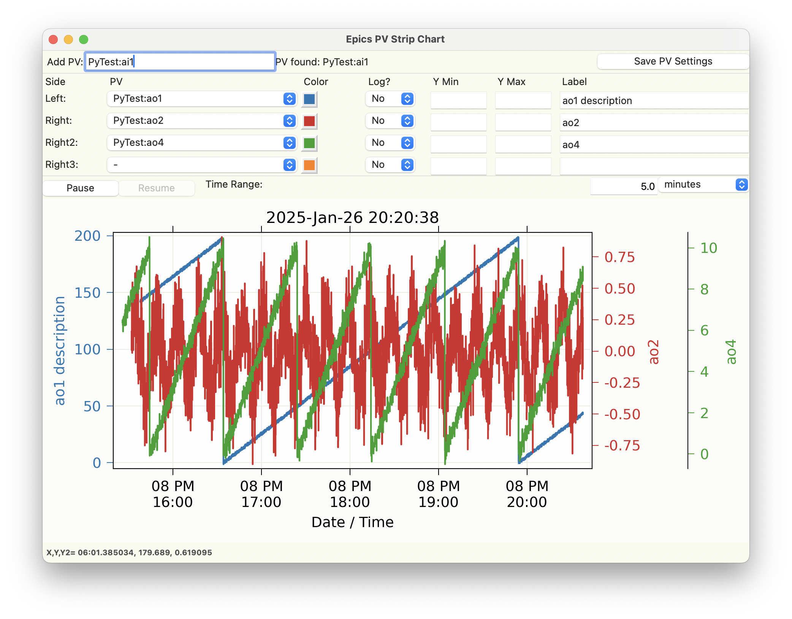

.. _stripchart:

Strip Chart Display
====================================

StripChart is a GUI application for viewing the time series of PVs as
a strip chart.  It feature interactive graphics, with click-and-drag
zooming, updating the plotted time range, saving figures as
high-quality PNGs, and saving data to ASCII files.  Stripchart is
inspired somewhat by the classic Epics Stripchart application written
with X/Motif, but has many differences.

Running  Stripchart
~~~~~~~~~~~~~~~~~~~~~~

To run the Stripchart application from the command line, use::

    epicsapps stripchart

You will be prompted for a Working Directory, where a configuration
file `stripchart.yaml` may be found, and where any images or data
files you save will be written.

A sample display would look like this:

Usage
~~~~~~~~~

To use StripChart, PVs to be monitored in the upper left entry.  Once
that PV connects, it will be added to the drop-down menus for each of
the 4 available traces.  Colors, Y-ranges, and descriptions (used for
the Y-axis labels) can be altered.  To save these settings for a PV,
press "Save PV Settings" in the upper right.

The time range (in time from the present) can be adjusted on the
right-hand side, just above the plot.

The "Pause" and "Resume" buttons pause and then resumes the plotting
of new values so that you can zoom in on parts of the plot using
Left-Down and Drag.

Note that data collection of new values will still happen while the
plot is paused, and resuming the plotting will show the most recent
data.

From the "File" Menu, you can save plain text files with the time
series data for all monitored PVs, or save a PNG image of the
plot. With the mouse over the plot window, Control-C will also copy
the PNG image to the clipboard.

You can also configure the plot from the "Options" menu.

Reading PVs from previous sessions
~~~~~~~~~~~~~~~~~~~~~~~~~~~~~~~~~~~~~~~

On startup, if a file called `stripchart.yaml` is found in the working
folder, it will be read, and you can select PVs from that file to
monitor.  You can also read PVs from a configuration file with a
different name or location using File Menu->"Read Configuration". When
you choose to read a configuration file, this will bring up a dialog
like this:

.. image:: images/stripchart_pvselect.png

where you can select which of these PVs to import.

This configuration file will include a list of the PVs (and
saved descriptions, ranges, etc), and might look like this::

    pvs:
    - ['S:SRcurrenxtAI.VAL', Storage Ring Current, false, '', '']
    - ['13XRM:QE2:SumAll:MeanValue_RBV', BPM Sum, false, '', '']
    - ['13IDE:userTran1.J', I0, false, '', '']

Here, for each PV, the PV name, description, whether to you Log-scale,
minimum value, and maximum value are written.

When StripChart is closed, it will save its configuration to
`stripchart.yaml` in the current working folder, making a backup if
needed.

.. _stripchart_timezone:

A note on Time Zones
~~~~~~~~~~~~~~~~~~~~~~~~~~~~~~~~~

The values plotted with StripChart uses date and time for the X axis.
The data received uses normal Unix timestamps (seconds since 1970,
recorded as floating point numbers).  When converting these to date
and time for plotting, the current time zone must be known.

If the displayed times are incorrect, it may be because the timezone
is not properly set. StripChart tries to automatically determine the
local timezone, but this may not always be correct.  Setting the
system environmental variable `TZ` to hold the name of the time zone
(such as `US/Eastern` or `Australia/Melbourne`) should make the times be
displayed correctly.
